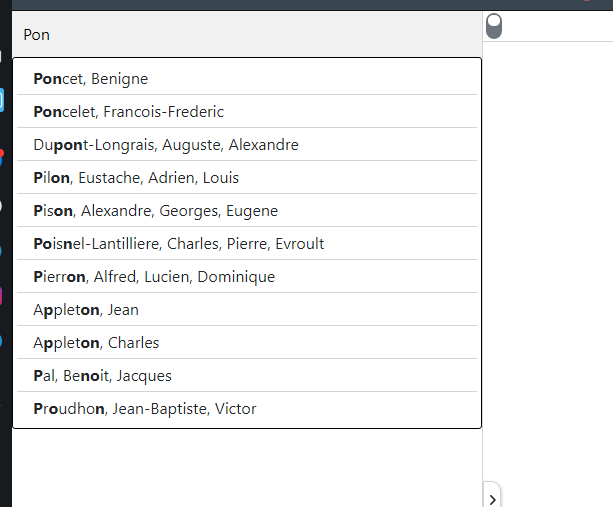
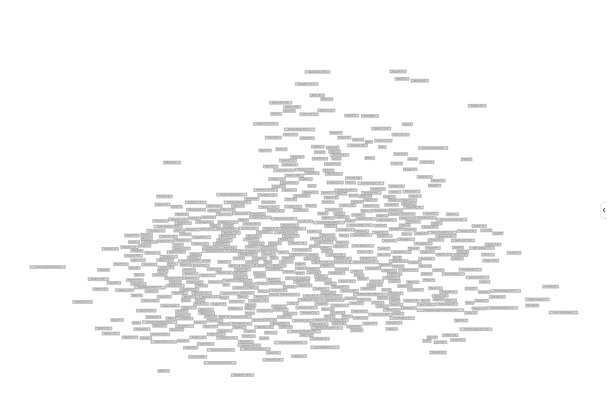
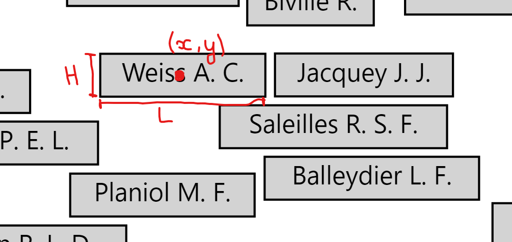

# Structure des données

> Quelles données entrantes dans l'application

Afin de fonctionner correctement, l'application utilise 5 source de données sous format JSON.

1. Liste des références des Acteurs, nommé `RefActors`
2. Liste des références des Lieux, nommé `RefLocalisations`
3. Liste des relations entre les individus `Links`
4. Position des differentes Acteurs sur le graphe d'ensemble, `Graph`
5. Détail des evènements pour chaque acteur. `ActorEvents`

> A quoi servent les differentes données ?

## Referencer les acteurs disponibles à la recherche

`RefActors` est une source qui est utilisée plusieurs fois à des fins differents.

L'une d'entre elles, et la plus importante est de référencer tous les acteurs disponibles. C'est utilisé par exemple dans le champ d'autocompletion situé en haut à gauche de l'application:


La structure est assez simple car il ne contient que peu d'informations concernant la ressource:

> **Exemple**: `ref-actors.json`
> ```json
> {
>   "30764": {
>     "kind": "Actor",
>     "id": 30764,
>     "label": "Batbie, Anselme",
>     "uri": "http://symogih.org/resource/Actr30764",
>     "url": "http://advanse.lirmm.fr/siprojuris/api/actor/30764/"
>   },
>   "40175": {
>     "kind": "Actor",
>     "id": 40175,
>     "label": "Escarra, Jean",
>     "uri": "http://symogih.org/resource/Actr40175",
>     "url": "http://advanse.lirmm.fr/siprojuris/api/actor/40175/"
>   },
> }
> ```

> **Définition**: `ref-actors.json`
>
> De manière plus générique la structure JSON est:
> ```json
> {
>     ID : {
>         "kind": "Actor",
>         "id": ID,
>         "label": NOM_PERSONNE,
>         "uri": LIEN_REFERENCE,
>         "url": LIEN_DONNEES
>     }
> }
> ```
> 
> Comme on peut le constater, chaque entité (`Ressource`) est identifiée par une clé unique `ID`.
>
> `LIEN_REFERENCE` représente la source d'où les données ont étés extraites (ici: depuis symogih).
>
> `LIEN_DONNEES` represente où les données sur cet acteur pourront être récupérés sous format JSON. 

---

## Afficher la vue d'ensemble



Afin d'afficher la vue d'ensemble, nous utilisons `Graph`.

> **Exemple**: `graph.json`
> 
> ```json
> [
>   {
>     "index": 30764,
>     "label": "Batbie A.",
>     "x": 2072.0088110289707,
>     "y": 1093.791822982072,
>     "width": 63,
>     "height": 20
>   },
>   {
>     "index": 40175,
>     "label": "Escarra J.",
>     "x": 1451.0732981499607,
>     "y": 1608.3109673898746,
>     "width": 64,
>     "height": 20
>   },
> ]
> ```


> **Définition**: `graph.json`
> 
> ```json
> [
>   {
>     "index": ID,
>     "label": NOM_PERSONNE,
>     "x": COORD_X,
>     "y": COORD_Y,
>     "width": LARGEUR,
>     "height": HAUTEUR
>   }
> ]
> ```
>
> `NOM_PERSONNE` est le nom qui sera affiché dans la vue d'ensemble.
> Dans notre exemple, le nom est raccourci afin d'éviter de surcharger
> l'interface
>
> `COORD_X`, `COORD_Y` représentent les coordonnées.
> `HAUTEUR`, `LARGEUR` représentent les dimensions de la boite:
> 

---

## Lors de l'ajout d'un Acteur, récuperer tous les évènements associés

Grâce à `RefActors`[<sup>ref</sup>](#referencer-les-acteurs-disponibles-à-la-recherche) pour récuperer les evenements associes à un acteur, il suffit de les récuperer via l'url fourni (exemple: http://advanse.lirmm.fr/siprojuris/api/actor/40175/).

Cet url retourne alors tous les evenements associés à cet acteur.

Ces evenements sont groupés par leur catégorie (naissance, décès, obtention de qualité, ...). C'est ce qu'on appellera des *sets*.

> **Exemple**
> 
> Pour avoir une idée de la structure réelle : http://advanse.lirmm.fr/siprojuris/api/actor/47733/
>
> Apercu:
> 
> ```json
> {
>     "kind": "Actor"
>     "id": 47733,
>     "label": "Accarias, Calixte",
>     "uri": "http://symogih.org/resource/Actr47733",
>     "url": "http://advanse.lirmm.fr/siprojuris/api/actor/47733/",
>     "retirement_set": [ ... ],
>     "birth_set": [ ... ],
>     "death_set": [ ... ],
>     "suspensionactivity_set": [ ... ],
>     "education_set": [ ... ],
>     "est_evalue_examen": [ ... ],
>     "evaluer_examen": [ ... ],
>     "obtainqualification_set": [ ... ],
>   },
> ```

---

chaque entitée doit être auto contenue

## Notation utilisée

j'utiliserais `?` pour representer un attribut facultatif. Cette notation ne fait pas parti du format JSON, c'est simplement plus pratique à utiliser lors de la définition de la structure:
>
> Exemple: 
> ```json
> {
>     "id": ID,
>     "label": NOM,
>     "information"?: OPTIONNEL
> }
> ```
>
> Dans cet exemple, `?` pour represente le fait que `information` peut ne pas exister.
>
> Par conséquent ces deux alternatives sont une représentation correcte de la donnée.
>
> ```json
> {
>   "id": 1,
>   "label": "Exemple 1",
>   "information": "ceci est l'exemple 1"
> }
> ```
> ```json
> {
>   "id": 2,
>   "label": "Exemple 2",
> }
> ```